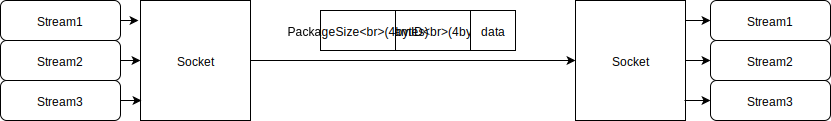

# go-multiplexingsocket
net.Conn multiplexing.



## how to use
1. import
```
import (
    socket "github.com/LiMoMoMo/go-multiplexingsocket"
)
```

2.get `Socket`
use `net.Conn` init `Socket`
```
	socket := socket.NewSocket(cancel, ctx, conn)
```

3. register `Stream`
use number register `Stream`
```
	stream3, _ := socket.Register(3)
```

4. use `Stream`
you can use `socket.Stream` as `io.ReadWriter`
